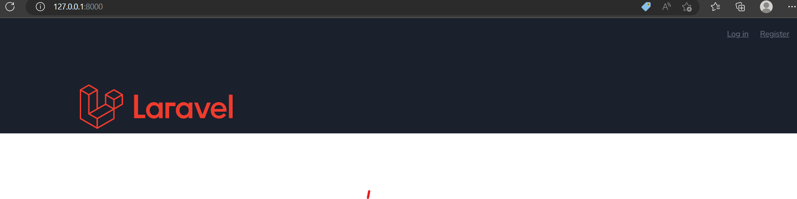
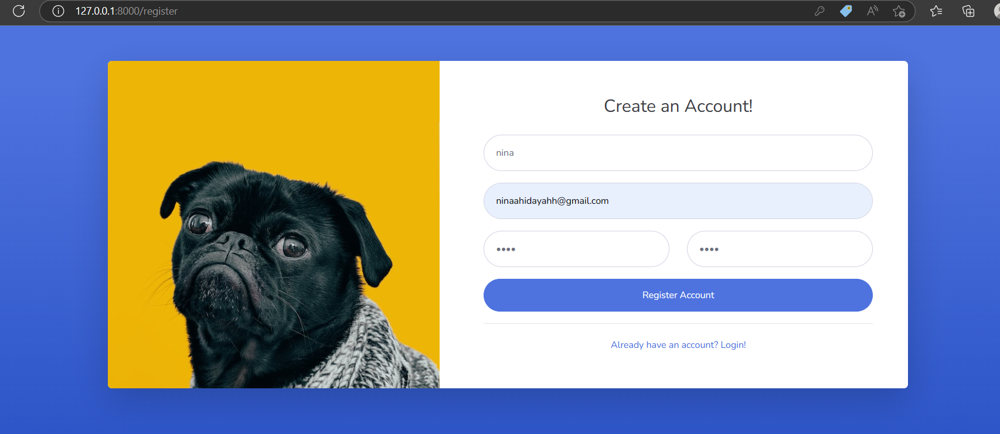
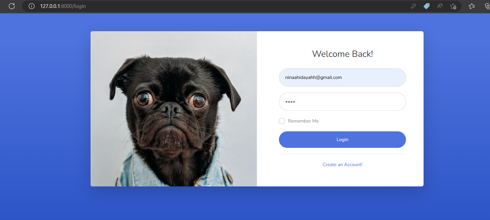

# TUGAS 6 | Studi Independen Program | GITS ID

<p align="center"><a href="https://laravel.com" target="_blank"></a></p>


## :woman: Creator
- Name:  Nina Hidayah 

- Campus: PGRI Ronggolawe University 


## :star: Technology Used:

 - Laravel 9
 - SweetAlert
 - Bootstrap Template SB Admin 2
 - FontAwesome
 
 ## Screenshot 






## :open_book: How To Use
1.  Clone this repository
    ```
    git clone https://github.com/ninahidayah/gits-msib4-TugasAuth.git
    ```
2.  Copy paste **.env.example** file and rename as **.env**
3.  Change the database name in the .env 

3.  Generate Key
    ```
    php artisan key:generate
    ```
4.  Install dependencies
    ```
    composer install
    ```
5.  Generate mirror link
    ```
    php artisan storage:link
    ```
6.  Migrate the tables
    ```
    php artisan migrate
    ```

7.  Insert the data from seeder to database (user login default)
    ```
    php artisan db:seed
    ```

8.  Start the server
    ```
    php artisan serve
    ```
